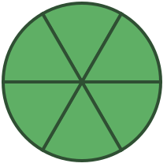
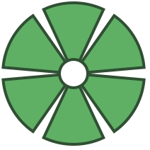
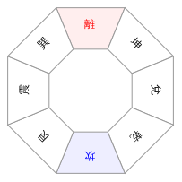

# SVG-FAN

**svg-fan** 是一个用于画各类弧形、扇形的`javascript`工具，也可以易于画出一个n等份的圆。

使用`typescript`编写，简单易用。

## 安装

```sh
npm install svg-fan
```

## 使用

### DEMO 01 画一个弧形


```html
<!-- html -->
<div  id="svg-wrapper"></div>
```

```typescript
// ESModule import
import { Arc } from 'svg-fan'
// 如果你使用的是commonJS, 请如w使用require引入
// const { Arc } = require('svg-fan')

const arc = new Arc({
  r: 30, // 内径
  R: 50, // 外径
  start: 20, // 圆弧起始角度
  end: 280, // 圆弧结速角度
  attr: {
    // 圆弧的svg属性设置
    fill: '#FF9988',
    stroke: '#cc2211',
    strokeWidth: 4
  }
})

arc.mount(document.getElementById('svg-wrapper')) // 挂载到指定容器显示
```

### DEMO 02 画一个圆环


```typescript
// ESModule import
import { Arc } from 'svg-fan'


const arc = new Arc({
  r: 30, // 内径
  R: 50, // 外径
  start: 0, // 当起始角与结束角度之差大于360度时，将变成一个圆
  end: 360, // 圆弧结速角度
  attr: {
    fill: '#443C85'
  }
})

arc.mount(document.getElementById('svg-wrapper')) // 挂载到指定容器显示
```


### DEMO 03 画一个扇形


```typescript
// ESModule import
import { Arc } from 'svg-fan'


const arc = new Arc({
  r: 0, // 内径为0时，即画扇形
  R: 50, // 外径
  start: 0, 
  end: 90,
  attr: {
    // 圆弧的svg属性设置
    fill: '#889C85'
  }
})

arc.mount(document.getElementById('svg-wrapper')) // 挂载到指定容器显示
```


### DEMO 04 把圆弧拉直变成梯形


```typescript
// ESModule import
import { Arc } from 'svg-fan'

const arc = new Arc({
  r: 20, // 内径
  R: 50, // 外径
  start: -30,
  end: 30,
  straighten: true, // 设置straighten为true时，把弧线拉直，但起点和终点的角度差必须少于180度
  attr: {
    // 圆弧的svg属性设置
    fill: '#5faf65'
  }
})

arc.mount(document.getElementById('svg-wrapper')) // 挂载到指定容器显示
```

### DEMO 05 在圆弧内添加文字


```typescript
// ESModule import
import { Arc } from 'svg-fan'

const arc = new Arc({
  r: 40, // 内径
  R: 80, // 外径
  start: -30,
  end: 30,
  attr: {
    fill: '#8870ee'
  },
  text: '离',
  textAttr: {
    fill: '#fff',
    fontSize: 18,
    fontWeight: 600
  }
})

arc.mount(document.getElementById('svg-wrapper')) // 挂载到指定容器显示
```


### DEMO 06 把圆等分成6份




```typescript
// ESModule import
import { Fan } from 'svg-fan'

const fan = new Fan({
  r: 0, // 内径
  R: 100, // 外径
  n: 6, // 分成6份
  attr: {
    fill: '#5faf65',
    strokeWidth: 4,
    stroke: '#2f4f33'
  }
})

fan.mount(document.getElementById('svg-wrapper')) // 挂载到指定容器显示
```

### DEMO 07 把圆等分成6份, 并设置每份弧相隔10度




```typescript
// ESModule import
import { Fan } from 'svg-fan'

const fan = new Fan({
  r: 20, // 内径
  R: 100, // 外径
  n: 6, // 分成6份
  gap: 10, // 每份相隔多少角度
  attr: {
    fill: '#5faf65',
    strokeWidth: 4,
    stroke: '#2f4f33'
  }
})

fan.mount(document.getElementById('svg-wrapper')) // 挂载到指定容器显示
```


### DEMO 08 把圆等分成4份, 每份颜色单独设置


```typescript
// ESModule import
import { Fan } from 'svg-fan'

const fan = new Fan({
  r: 60, // 内径
  R: 100, // 外径
  n: 4, // 分成4份,
  attr: {
    strokeWidth: 4,
    stroke: '#2f4f33'
  },
  arcSetting: [
    {
      attr: {
        fill: '#2f6f65'
      }
    },
    {
      attr: {
        fill: '#5f8f65'
      }
    },
    {
      attr: {
        fill: '#7faf65'
      }
    },
    {
      attr: {
        fill: '#afcf65'
      }
    }
  ]
})

fan.mount(document.getElementById('svg-wrapper')) // 挂载到指定容器显示
```


### DEMO 09 设置start值，使第一份弧的起始角度为0


```typescript
// ESModule import
import { Fan } from 'svg-fan'

const fan = new Fan({
  r: 60, // 内径
  R: 100, // 外径
  n: 4, // 分成4份,
  start: 0, // 通过设置start值，可设置第一份弧的起始角度，否则第一份弧形的中心会位默认于正上方。
  attr: {
    strokeWidth: 4,
    stroke: '#2f4f33'
  },
  arcSetting: [
    {
      attr: {
        fill: '#2f6f65'
      }
    },
    {
      attr: {
        fill: '#5f8f65'
      }
    },
    {
      attr: {
        fill: '#7faf65'
      }
    },
    {
      attr: {
        fill: '#afcf65'
      }
    }
  ]
})

fan.mount(document.getElementById('svg-wrapper')) // 挂载到指定容器显示
```


### DEMO 10 画一个八卦




```typescript
// ESModule import
import { Fan } from 'svg-fan'

const fan = new Fan({
  r: 50,
  R: 100,
  n: 8,
  straighten: true,
  attr: {
    strokeWidth: 1,
    stroke: '#999',
    fill: '#fff'
  },
  arcSetting: [
    {
      text: '離',
      textAttr: {
        fill: 'red'
      },
      attr: {
        fill: '#ffeeee'
      }
    },
    {
      text: '坤'
    },
    {
      text: '兌'
    },
    {
      text: '乾'
    },
    {
      text: '坎',
      textAttr: {
        fill: 'blue'
      },
      attr: {
        fill: '#eeeeff'
      }
    },
    {
      text: '艮'
    },
    {
      text: '震'
    },
    {
      text: '巽'
    }
  ]
})

fan.mount(document.getElementById('svg-wrapper')) // 挂载到指定容器显示
```
